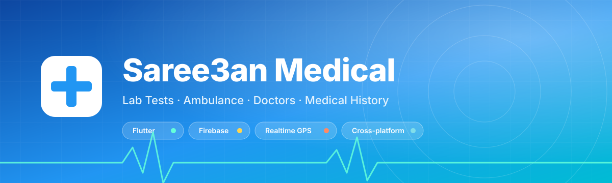
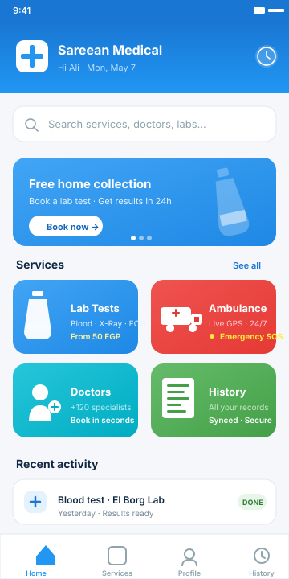
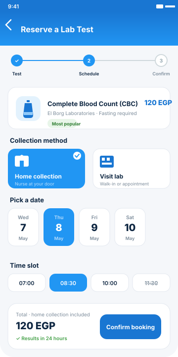
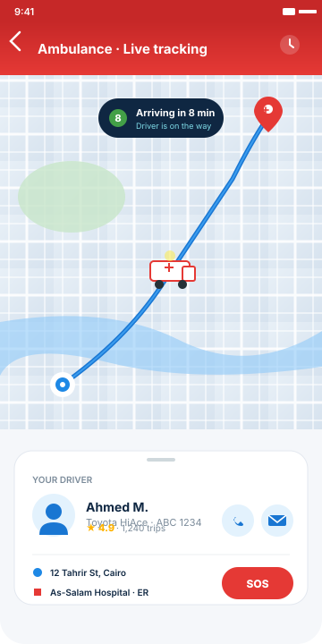
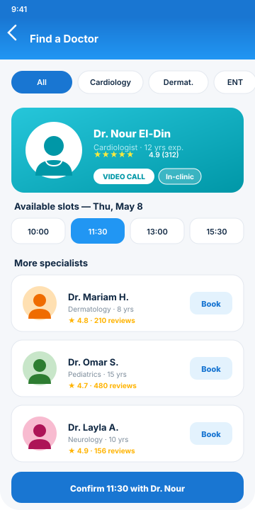
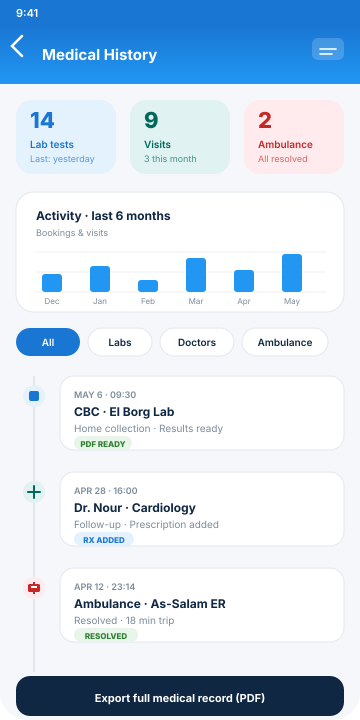

# Saree3an Medical App

<div align="center">
  

  <h3>🏥 Your Complete Medical Services Solution</h3>
  <p><strong>Book Lab Tests • Request Ambulances • Schedule Doctors • Track Medical History</strong></p>

  
  
  
</div>

---

## 📊 Repository Statistics

### Language Composition
```
Dart       ████████████████████████████████████████ 91.8%
C++        ██▌ 4.1%
CMake      █▌ 3.2%
Swift      ▌ 0.5%
C          ▌ 0.2%
HTML       ▌ 0.2%
```


---

## 📸 Screenshots & Demo

### 🎨 App Features Visual Overview

<div align="center">
  
  
  
</div>

<div align="center">
  
  
</div>

<table>
  <tr>
    <td align="center" width="50%">
      <h3>🔬 Lab Test Booking</h3>
      <p>Pick from blood work, X-Ray, ultrasound, ECG and more. Choose home collection or visit the lab, and get results in 24 hours.</p>
    </td>
    <td align="center" width="50%">
      <h3>🚑 Ambulance Services</h3>
      <p>Live GPS tracking with driver details, real-time ETA, in-app call/message, and an emergency SOS button — 24/7.</p>
    </td>
  </tr>
  <tr>
    <td align="center" width="50%">
      <h3>👨‍⚕️ Doctor Appointments</h3>
      <p>Browse 120+ specialists, see ratings &amp; reviews, and book a video call or in-clinic visit in seconds.</p>
    </td>
    <td align="center" width="50%">
      <h3>📋 Medical History</h3>
      <p>A unified timeline of every lab, visit and ambulance trip, with downloadable PDFs and full record export.</p>
    </td>
  </tr>
</table>


---


</div>
